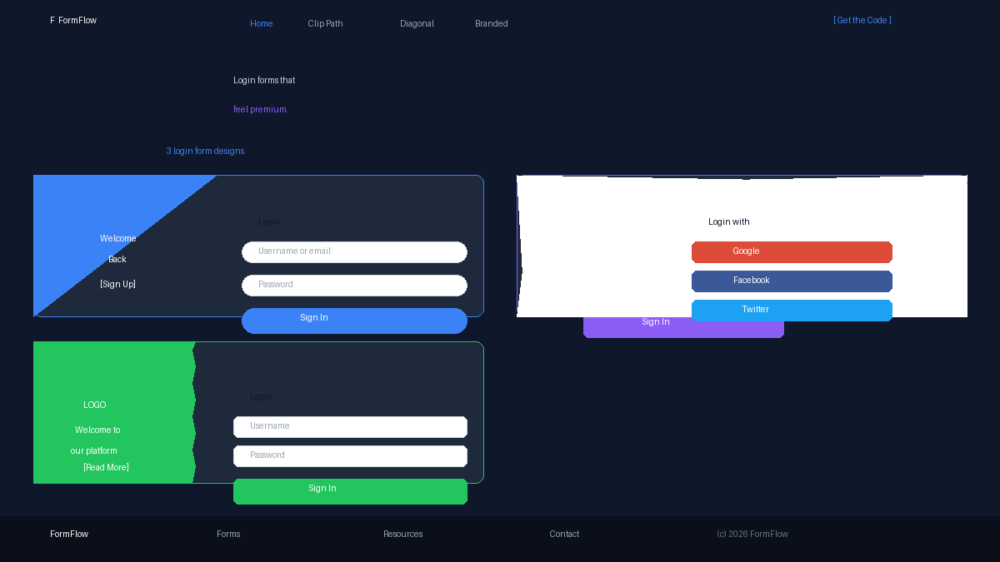

# FormFlow — CSS Login Form Templates

**FormFlow** is a premium, framework-free showcase of **3 CSS login form templates** — triangular clip-path panels, diagonal split layouts, and branded forms with logo. Built with pure HTML5, CSS3 and a touch of vanilla JS — no libraries, no build tools, copy-and-paste ready.

**[View Live Demo →](https://uiuxlabz.github.io/login-form-template-html-template/)**

---

## ✨ What's Inside

| Form Style | CSS class | What you get |
|---|---|---|
| **Clip-Path Triangle** | `.l1-wrap` | Blue→purple gradient panel clipped into a triangle, white form card with rounded inputs, blue submit button |
| **Diagonal Panels** | `.l2-wrap` | Two diagonal clip-path panels — left has login form (purple submit), right has Google/Facebook/Twitter social buttons |
| **Branded with Logo** | `.l3-wrap` | Jagged green clip-path panel with logo, white form card with green submit, two footer links |

Each form is **self-contained** — grab the HTML snippet and its matching CSS rule and it works anywhere.

## 🚀 Getting Started

1. **Clone or download** this repository.
2. Open `index.html` in your browser — no server required.
3. Scroll through all three login form variants.

To use a style in your own project:

```html
<!-- 1. Copy the HTML -->
<div class="l1-wrap">
  <div class="l1-left">
    <div class="l1-left-content">
      <h2>Welcome Back</h2>
      <p>Create your account.<br>It's totally free.</p>
      <a href="#" class="l1-btn">Sign Up</a>
    </div>
  </div>
  <div class="l1-right">
    <h2>Login</h2>
    <form>
      <div class="l1-field">
        <label>Username or email <span>*</span></label>
        <input type="text" placeholder="Username or Email" required>
      </div>
      <div class="l1-field">
        <label>Password <span>*</span></label>
        <input type="password" placeholder="Password" required>
      </div>
      <button type="submit" class="l1-submit">Sign In</button>
    </form>
    <div class="l1-link"><a href="#">Forgot Password?</a></div>
  </div>
</div>

<!-- 2. Copy the matching .l1-wrap rules into your stylesheet -->
```

## 🗂 Project Structure

```
login-form-template-html-template/
├── index.html              # Single-page showcase (3 login form styles)
├── assets/
│   ├── css/
│   │   └── style.css       # Design tokens + all 3 form styles
│   ├── js/
│   │   └── main.js         # Vanilla JS: nav toggle, reveal, back-to-top, smooth scroll
│   └── img/
│       ├── logo.png         # Brand logo for Form 3
│       ├── demo-1.png       # Source form 1 screenshot
│       ├── demo-2.png       # Source form 2 screenshot
│       ├── demo-3.png       # Source form 3 screenshot
│       └── img-preview.jpg  # Original concept preview
├── screenshot.png           # Preview image for galleries
└── README.md
```

## 📸 Screenshot



## 🎨 Design System

- **Palette:** Blue `#3b82f6`, purple `#8b5cf6`, teal `#14b8a6`, green `#22c55e` on dark slate `#0f172a`
- **Type:** Bricolage Grotesque (display) + Inter (body)
- **Layout:** CSS Grid + Flexbox, clip-path polygons, fully responsive (992px / 768px breakpoints)
- **Motion:** 300–400ms eased transitions, IntersectionObserver reveal animations
- **No frameworks:** zero dependencies, zero build step

## 🛠 Customization

| Want to… | Do this |
|---|---|
| Change brand colors | Edit `--clr-blue`, `--clr-purple`, `--clr-teal`, `--clr-green`, `--clr-ink` in `:root` |
| Adjust triangle clip-path | Modify the `clip-path: polygon(...)` in `.l1-left` |
| Change diagonal angles | Tweak the `clip-path: polygon(...)` in `.l2-left` and `.l2-right` |
| Modify jagged edge | Update the polygon points in `.l3-left` for different sawtooth patterns |
| Tweak animation speeds | Change `transition` durations in the respective form rules |

## 📄 License

This template is licensed under the **MIT License** — free for personal and commercial use. You may use, modify and redistribute it, provided you retain the copyright notice.

---

**Built with ❤️ by [UI/UX Labz](https://github.com/uiuxlabz)** · [View all templates](https://github.com/uiuxlabz) · **Ready to build something great? [Start a project →](mailto:hello@formflow.dev)**
